# Task Management System

## Description
This is a scalable task management system built as a backend-focused assignment project.  
It provides secure authentication, role-based authorization, and CRUD operations for managing tasks.  
A simple React frontend is included to interact with the backend APIs.

---

## Backend Features
- User Registration & Login APIs
- JWT Authentication
- Password Hashing using `bcryptjs`
- Role-Based Access Control (`admin` and `user`)
- CRUD APIs for tasks
- Protected Routes using middleware
- Input validation & sanitization
- Centralized error handling
- API versioning support
- MongoDB database integration using `Mongoose`

---

## Frontend
A simple React frontend is included to:
- Register/Login users
- Access protected dashboard
- Perform CRUD operations on tasks
- Display API success/error messages

---

## Screenshots
Below are sample screenshots from the application:

### Sign Up pages
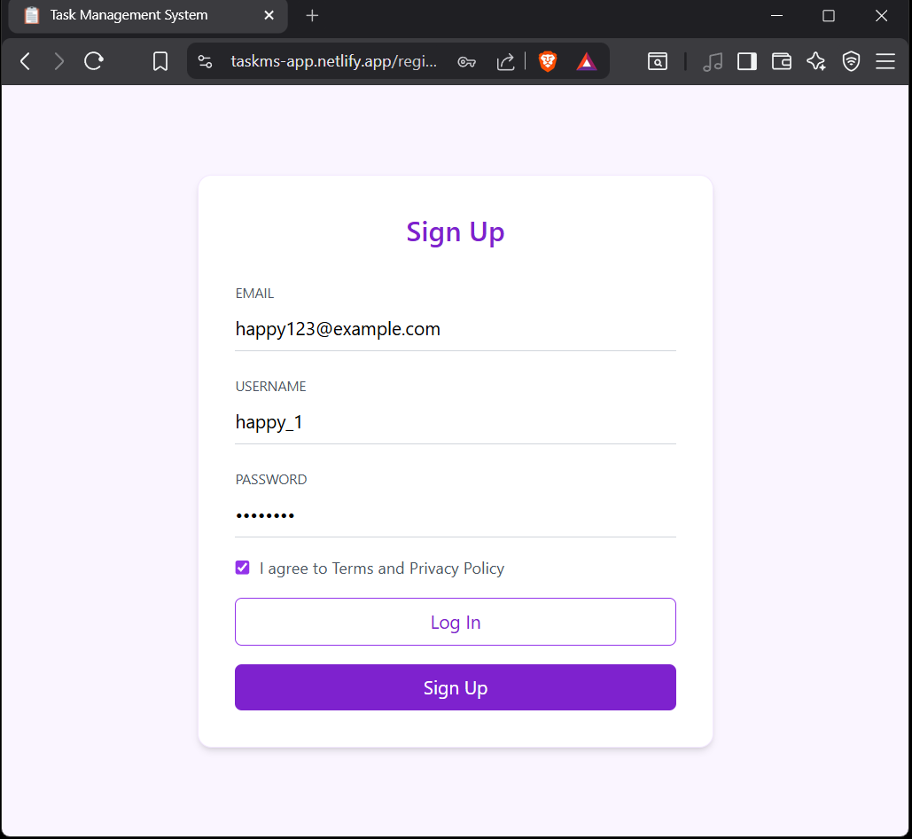
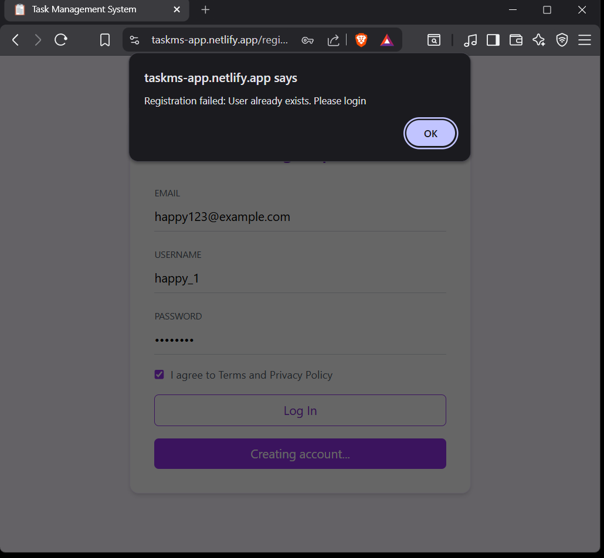
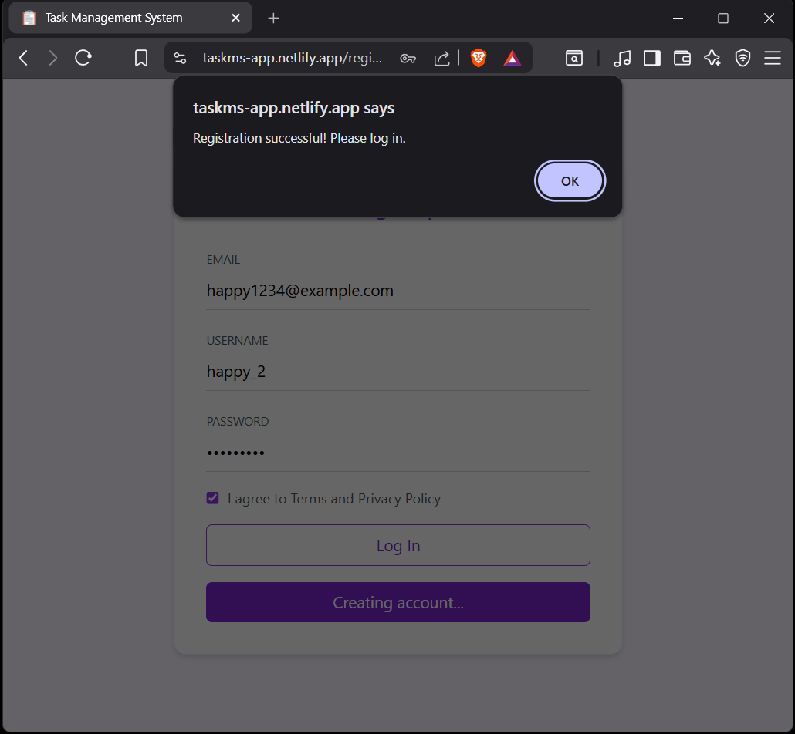

### Login pages
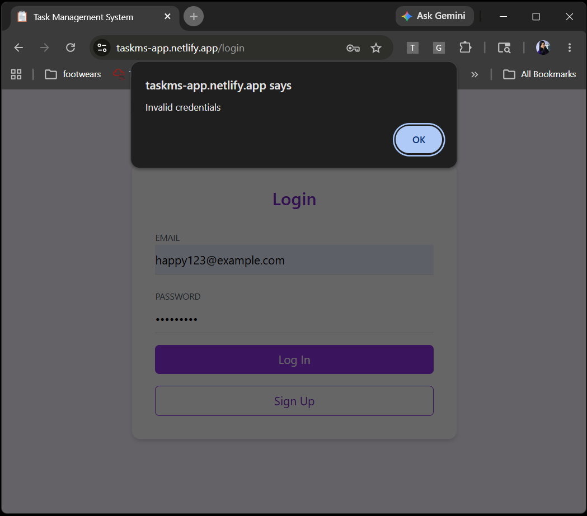
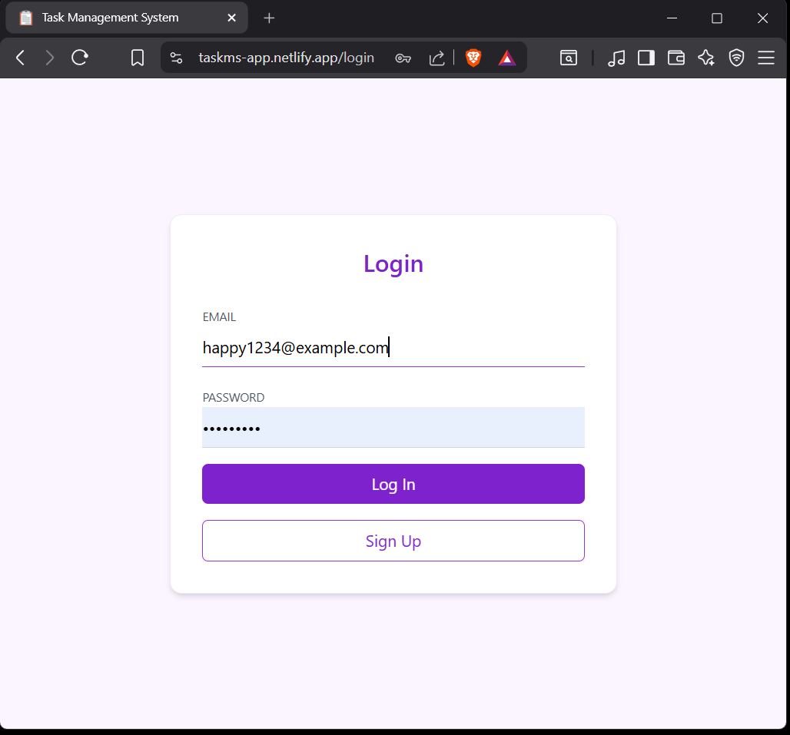

### Dashboard
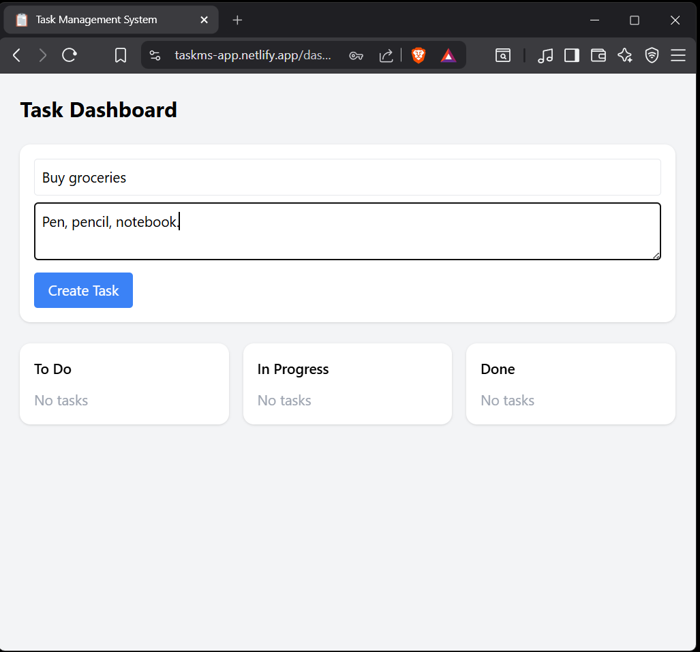
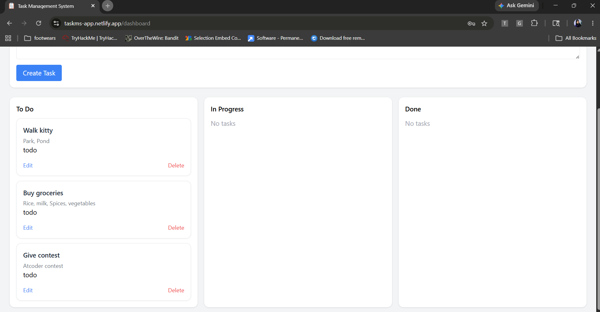

### Edit options
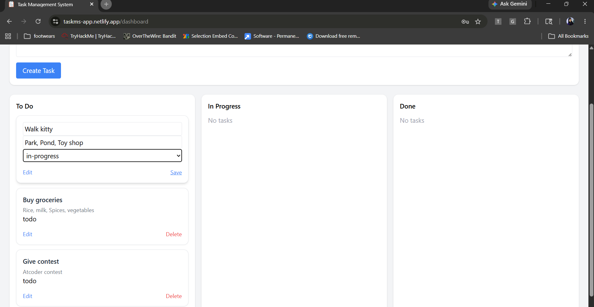
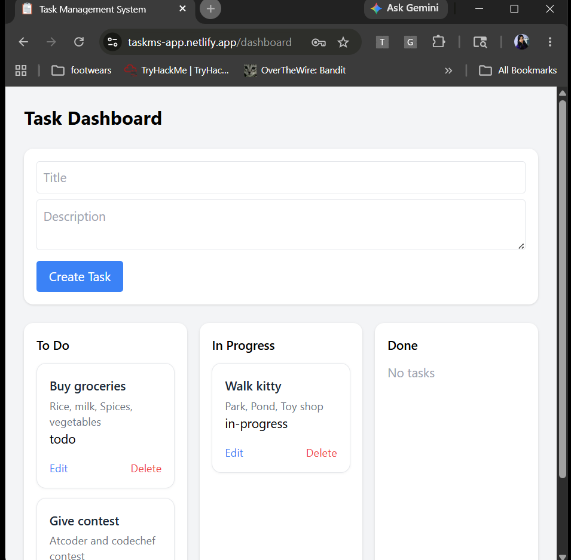
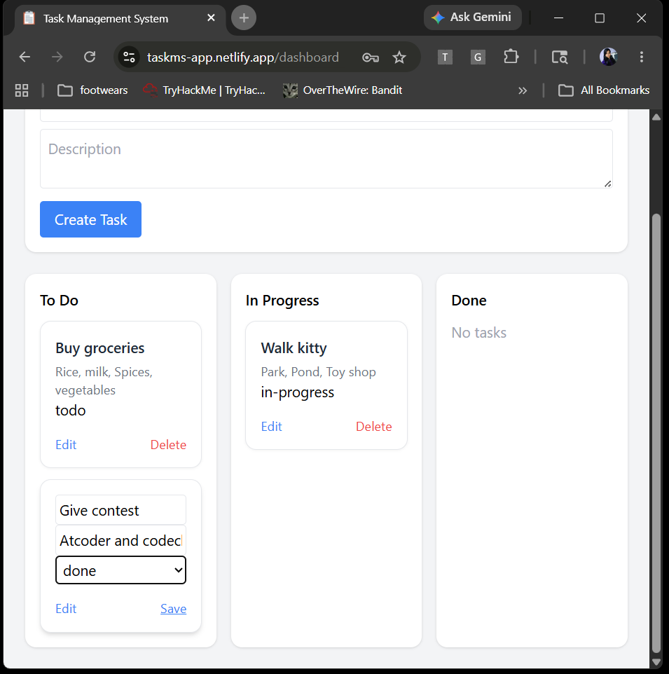
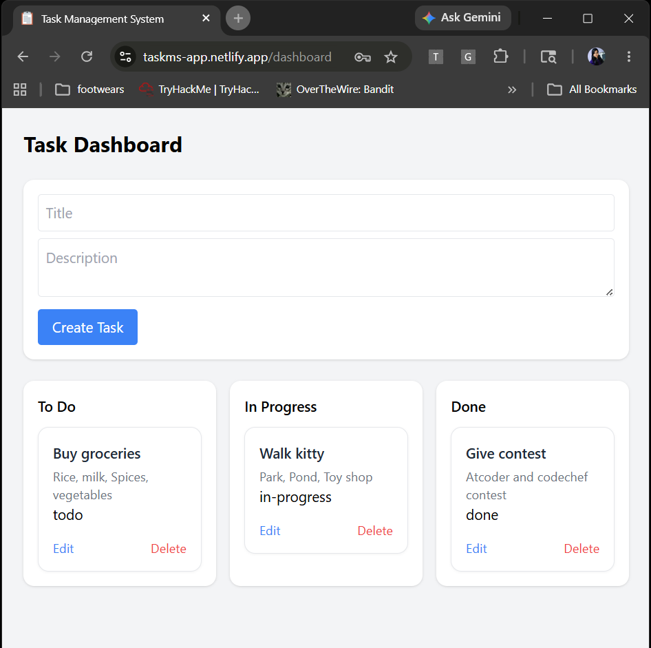

### Delete options
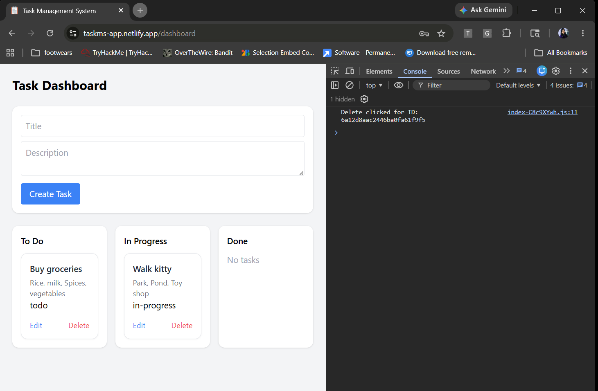
---

## Project Structure

```bash
project-root/
│
├── backend/
│   ├── config/
│   │   ├── database.js
│   │
│   ├── controllers/
│   │   ├── authController.js
│   │   ├── taskController.js
│   │
│   ├── middleware/
│   │   ├── adminMiddleware.js
│   │   ├── authMiddleware.js
│   │
│   ├── models/
│   │   ├── task.js
│   │   ├── user.js
│   │
│   ├── routes/
│   │   ├── authRoutes.js
│   │   ├── taskRoutes.js
│   │
│   ├── .env
│   ├── app.js
│   ├── server.js
│   └── package.json
│
├── frontend/
│   ├── public
│   │   ├── favicon.ico
│   │   │
│   ├── src/
│   │   ├── components/
│   │   │   ├── ProtectedRoute.jsx
│   │   │   ├── TaskCard.jsx
│   │   │   ├── TaskForm.jsx
│   │   │
│   │   ├── pages/
│   │   │   ├── Dashboard.jsx
│   │   │   ├── Login.jsx
│   │   │   ├── Register.jsx
│   │   │
│   │   ├── services/
│   │   │   ├── api.js
│   │   │
│   │   ├── utils/
│   │   │   ├── auth.js
│   │   │
│   │   ├── App.jsx
│   │   └── main.jsx
│   │
│   └── index.html
│   └── package.json
│   └── .env
│
├── screenshots/
├── task-management-api.postman_collection.json
├── README.md
```

---

## Installation

Clone the repository and install dependencies:

```bash
git clone https://github.com/menukahansda/task-management-system.git
cd task-management-system
```

### Backend

```bash
cd backend
npm install
```

### Frontend

```bash
cd frontend
npm install
```

---

## Available Scripts

### Backend
``` bash
npm run dev     # start in development mode
npm start       # start production server
```

### Frontend
``` bash
npm run dev     # start React app (Vite)
npm run build   # production build (optional)
```
---

## API Endpoints

### Authentication Routes

| Method | Endpoint | Description |
|--------|----------|-------------|
| POST | /api/v1/auth/register | Register User |
| POST | /api/v1/auth/login | Login User |

---

### Task Routes

| Method | Endpoint | Description |
|--------|----------|-------------|
| POST | /api/v1/tasks | Create Task |
| GET | /api/v1/tasks | Get All Tasks |
| GET | /api/v1/tasks/:id | Get Single Task |
| PUT | /api/v1/tasks/:id | Update Task |
| DELETE | /api/v1/tasks/:id | Delete Task |

---

## Security Features

- Password hashing using `bcryptjs`
- JWT token authentication
- Protected API routes
- Role-based authorization
- Input validation & sanitization
- Environment variable protection

---

## API Documentation

- Postman Collection included

---

## Requirements

- Node.js >= 18
- MongoDB

---

## Tech Stack

### Backend
- Node.js
- Express.js
- MongoDB
- Mongoose
- JWT
- bcryptjs

### Frontend
- React
- Vite

---

## Environment Variables

### Backend

```bash
PORT=4000
MONGO_URI=your_mongodb_connection_string
JWT_SECRET=your_jwt_secret
```

### Frontend

```bash
VITE_API_URL=http://localhost:4000
```

Or your deployed backend URL.

---

# Important Note

- Make sure `.env` file is properly configured before running
- Ensure MongoDB connection is active
- Use secure JWT secret values in production

---

